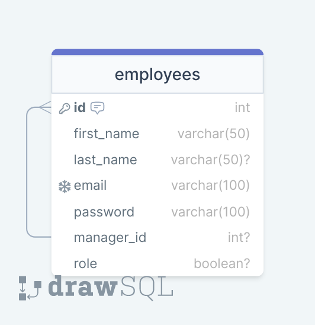

# P.E.R.N. Employees backend

Full stack app uses postgreSQL - express.js - react.js and node.js.

## How to use this project

1. Clone the repository
2. Rename [.env.example](.env.example) file to ***.env*** and complete the environment variables
3. Run `docker compose up -d` from your favorite cli
4. Consume the services or use the frontend project

## Database diagram

